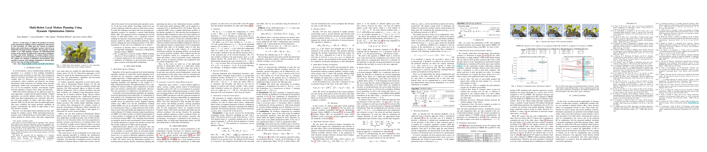

# multi-robot-fabrics

Implementation of multi-robot-fabrics presented in our MRS 2023 paper **"Multi-Robot Local Motion Planning Using Dynamic Optimization Fabrics"**

[](https://arxiv.org/pdf/2310.12816.pdf)

In this paper, we address the problem of real-time
motion planning for multiple robotic manipulators that operate
in close proximity. We build upon the concept of dynamic
fabrics and extend them to multi-robot systems, referred to as
Multi-Robot Dynamic Fabrics (MRDF). This geometric method
enables a very high planning frequency for high-dimensional
systems at the expense of being reactive and prone to deadlocks.
To detect and resolve deadlocks, we propose Rollout Fabrics
where MRDF are forward simulated in a decentralized manner.
We validate the methods in simulated close-proximity pick-and-place scenarios with multiple manipulators, showing high
success rates and real-time performance.

A **video** showcasing the presented approach can be found [here](https://www.youtube.com/watch?v=jaJBrSecDcM).

The current version of the paper can be cited using the following reference:
```bibtex
@inproceedings{bakker2023multi,
  title={Multi-Robot Local Motion Planning Using Dynamic Optimization Fabrics},
  author={Bakker, Saray and Knoedler, Luzia and Spahn, Max and B{\"o}hmer, Wendelin and Alonso-Mora, Javier},
  booktitle={2023 International Symposium on Multi-Robot and Multi-Agent Systems (MRS)},
  pages={149--155},
  year={2023},
  organization={IEEE}
}
```

This repository is meant to explore the use of fabrics for multiple mobile robots/robotic manipulators.
Several flavors are explored:
- Fabrics applied to multi-robot scenarios. 
- Rollout fabrics applied to multi-robot scenarios. (Forward predictions over a horizon to detect future deadlocks or other undesired states)
  
The 'examples' folder provides runnable examples of different scenarios.

## Teaser


## Options
This repository includes examples of the application of multi-robot fabrics to point robots and Panda robotic arms.
The examples can be run 
1) without rollouts (in the paper referred to as MRDF),
2) with rollout fabrics and deadlock resolution heuristic (in the paper referred to as RF), and
3) with rollout fabrics, constant velocity goal estimation and deadlock resolution (in the paper referred to as RF-CV)

While dynamic fabrics ([Spahn2023](https://ieeexplore.ieee.org/stamp/stamp.jsp?arnumber=10086617)) are applied in the paper, we also support static fabrics as introduced in [Ratliff2020](https://arxiv.org/pdf/2008.02399.pdf).
The point-robot example was added for easy understanding and does currently not provide support for rollout fabrics and deadlock resolution. 

Which configuration is used can be accessed in `examples/configs`. Here, also the number of robots and the number of collision spheres can be adapted.
Further parameters can be adapted in 'parameters_manipulators.py'.

<table>
 <tr>
  <td> Point Robot </td>
  <td> 2 Panda Scenario  </td>
  <td> 3 Panda Scenario </td>
 </tr>
 <tr>
  <td>  </td>
  <td>  </td>  
  <td>  </td>
 </tr>
</table>

## Installations
Clone this repository and go to its root:

    git clone git@github.com:tud-amr/multi-robot-fabrics.git
    cd multi-robot-fabrics
    
You can install the package using poetry. For more details on poetry see [installation instructions](docs/installation.md).

    poetry install

The requirements can be found in [pyproject.toml](pyproject.toml). 

## Usage
Enter the virtual environment using:

    poetry shell
    
In the folder `multi_robot_fabrics` run

    python examples/<example-file-name>

E.g. to run the panda example `python examples/example_pandas_Jointspace.py`.
    

## Troubleshooting

If you run into problems of any kind or have a question, do not hesitate to open an [issue](https://github.com/tud-amr/multi-robot-fabrics/issues) on this repository. 
Or have a look at the tips we summarized [here](docs/tips.md).
